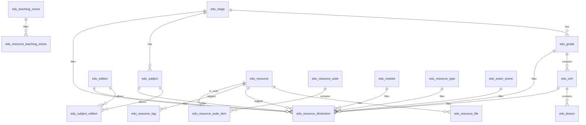

# 新课堂教育 — 数据库全方位设计方案

> 本文档整合前后端资源体系设计，对标教习网/学科网类 K12 教育资源平台。  
> 涵盖：学段·学科·栏目·资源类型·文件格式·多维筛选·上传/列表 API 协作，以及与现有代码（`edu_*`、`oss_primary_chinese_resource`）的迁移策略。  
> 目标库名统一为 **`xinketang`**；SQL 脚本归集至 **`k12-edu-microservice/sql/`**。

---

## 目录

1. [设计目标与原则](#设计目标与原则)
2. [现状与整合策略](#现状与整合策略)
3. [两类分类：内容形态 vs 栏目专区](#两类分类内容形态-vs-栏目专区)
4. [逻辑架构与 ER 关系](#逻辑架构与-er-关系)
5. [基础维度表设计](#基础维度表设计)
6. [资源主数据与文件表](#资源主数据与文件表)
7. [多维筛选与关联表](#多维筛选与关联表)
8. [教习网类资源与栏目落表对照](#教习网类资源与栏目落表对照)
9. [前后端协作约定](#前后端协作约定)
10. [相对现有方案的优化清单](#相对现有方案的优化清单)
11. [SQL 脚本目录规划](#sql-脚本目录规划)
12. [实施阶段建议](#实施阶段建议)

---

## 设计目标与原则

| 原则 | 说明 |
|------|------|
| **维度正交** | 内容形态（教案/试卷）、栏目（月考/期中）、教学场景（预习/公开课）、文件格式（docx/pdf/mp4）分表管理，禁止塞进单一 `dict.type` |
| **ID 关联** | 筛选与写入使用维度表主键；展示名通过 JOIN 获取 |
| **一资源多文件** | 主文件、答案、解析、音视频分 `edu_resource_file` 存储 |
| **多维可扩展** | 关联表 + 多对多（栏目、地区）+ 可选搜索扁平表 |
| **兼容过渡** | 短期保留 `oss_primary_chinese_resource` 宽表；中期迁入 `edu_resource` |

---

## 现状与整合策略

### 当前三套模型并存

| 体系 | 位置 | 特点 |
|------|------|------|
| **扁平 dict + resource** | `sql/k12_complete_database.sql`、`init_resource_tables.sql` | 学段/学科/类型在 `dict`；`resource` 用字符串字段 |
| **规范化 edu_*** | `sql/edu_dimension_tables.sql` | `edu_stage/subject/edition/grade/module/resource_type/unit` + `edu_resource` + `edu_resource_dimension` |
| **OSS 小学语文宽表** | `oss_primary_chinese_resource` | 维度为字符串；**当前 P0–P2 后端主用** |

### 其它模块 SQL 分散

- 认证：`k12-auth/.../auth_upgrade.sql`、`auth_fix_oauth_unique.sql`
- 互动：`collection`、`share_record`、搜索、上传
- 班会频道：`k12_banhui_category.sql`
- 增量：`p0/p1/p2_migration.sql`

### 整合策略（两阶段）

**阶段 A（兼容现有 Java 代码）**

1. 统一库名 `xinketang`，JDBC 连接该库；实体可保留 `xinketang.表名` 或仅用表名。
2. 保留 `oss_primary_chinese_resource`，补全 `edu_*` 种子与 API。
3. 可选：在宽表上增加 `stage_id/subject_id/...` 冗余 FK，便于迁移。

**阶段 B（目标态）**

- 新资源写入 `edu_resource` + `edu_resource_dimension` + `edu_resource_file`。
- 宽表改为视图或同步表，最终废弃字符串维度。

---

## 两类分类：内容形态 vs 栏目专区

| 维度 | 用户感知 | 示例 | 设计 |
|------|----------|------|------|
| **A. 内容形态** | 这是什么材料 | 教案、学案、练习、试卷、电子课本、音频朗读、视频、教师用书、课堂实录、讲义、说课稿、教学计划、预习、逐字稿、公开课、教学反思… | `edu_resource_type`（树形） |
| **B. 栏目/专区** | 什么教学节点用 | 同步备课、月考、期中、期末、开学、小升初、真题、模拟、专题复习、真题汇编、暑假、寒假、作文、阅读、竞赛… | `edu_module`（带 `module_category`） |
| **C. 教学场景** | 教学环节标签 | 预习、新课、复习、公开课、备考 | `edu_teaching_scene`（多选） |
| **D. 文件载体** | 文件格式 | docx、pptx、pdf、mp3、mp4、zip | `edu_resource_file` + `file_format` |
| **E. 教材体系** | 学段学科版本单元 | 小学语文统编版五年级上册第三单元 | `edu_stage` ~ `edu_lesson` |

**注意**：「期中/期末」可同时出现在 **栏目（module）** 与 **考试场景（exam_scene）**——栏目偏运营入口，exam_scene 偏试卷属性。

---

## 逻辑架构与 ER 关系



**核心表职责**

| 表 | 职责 |
|----|------|
| `edu_resource` | 业务资源：标题、状态、统计、审核、是否成套入口 |
| `edu_resource_file` | OSS 文件：扩展名、大小、预览、主/附件角色 |
| `edu_resource_dimension` | 单值维度关联（学段/学科/版本/年级/栏目/类型/单元等） |
| `edu_resource_module` 等 | 多选维度（栏目、地区） |
| `edu_resource_suite` | 成套资源（试卷汇编、多文件套装） |

---

## 基础维度表设计

### 3.1 教材体系（E 层）

| 表名 | 作用 | 关键字段 |
|------|------|----------|
| `edu_stage` | 学段 | `code`: primary/junior/senior/art/dance, `name`, `sort` |
| `edu_grade` | 年级 | `stage_id`, `name`, `sort` |
| `edu_subject` | 学科 | `stage_id`, `code`, `name`, `icon` |
| `edu_edition` | 教材版本 | `name`, `short_name`, `publisher`, `year_label` |
| `edu_semester` | 学期 | 上学期/下学期 |
| `edu_volume` | 册别 | 上册/下册/全册 |
| `edu_subject_edition` | 学科可用版本 | `subject_id`, `edition_id`（对应前端 `subjectVersionsMap`） |
| `edu_unit` | 单元 | `subject_id`, `grade_id`, `edition_id`, `volume_id`, `name`, `sort` |
| `edu_lesson` | 课文/课时 | `unit_id`, `name`, `sort` |
| `edu_knowledge_point` | 知识点（可选） | `lesson_id` 或 `subject_id`, `name`, `parent_id` |

前端对照：`k12-edu-platform/src/config/subjectConfig.ts`（stages、subjectDataMap、allVersions）。

### 3.2 内容形态（A 层）— `edu_resource_type`

建议**树形**结构：

| 一级 group | 二级 type 示例 |
|------------|----------------|
| 备课授课 | 教案、学案、课件、讲义、说课稿、教学计划、预习单、课堂实录、公开课、逐字稿 |
| 练习测评 | 课时练习、单元测试、试卷、答案解析 |
| 复习备考 | 复习提纲、专题讲义、错题汇编 |
| 教材教辅 | 电子课本、教师用书 |
| 音视频 | 音频朗读、微课、知识点视频、示范课 |
| 反思总结 | 教学反思、教学总结 |
| 素材 | 图片素材、课件模板 |

```sql
-- 逻辑字段示例
edu_resource_type (
  id, parent_id, code, name, icon,
  group_code, group_name,
  default_exts,      -- JSON: ["ppt","pptx"]
  allow_preview,
  sort, status
)
```

### 3.3 栏目/专区（B 层）— `edu_module`

```sql
edu_module (
  id, code, name, icon,
  module_category,   -- sync|monthly|term|holiday|transition|topic|competition|composition|reading
  applicable_stages, -- JSON 或关联表 edu_module_stage
  sort, status, description
)
```

**栏目种子（module_category）**

| module_category | 栏目名 |
|-----------------|--------|
| sync | 同步备课 |
| monthly | 月考专区 |
| term | 期中专区、期末专区 |
| holiday | 暑假专区、寒假专区 |
| transition | 小升初专区、开学专区 |
| exam | 真题汇编、小升初模拟、专题复习 |
| composition | 作文专区 |
| reading | 阅读理解 |
| competition | 竞赛专区 |

### 3.4 考试/备考场景 — `edu_exam_scene`

```sql
edu_exam_scene (
  id, code, name,
  exam_level,  -- 单元/月考/期中/期末/小升初/中考/高考
  sort
)
```

### 3.5 教学场景标签（C 层）— 多选

```sql
edu_teaching_scene (id, code, name)
edu_resource_teaching_scene (resource_id, teaching_scene_id)
```

适用于：预习、公开课、复习、备考等，避免 `resource_type` 无限膨胀。

### 3.6 特色频道

```sql
edu_channel (id, code, name)           -- main, banhui, patriotic
feature_category (id, channel_id, parent_id, code, name)
edu_resource_feature (resource_id, channel_id, feature_category_id)
```

班会/爱国教育等走 `feature_category`，与主站 `edu_module` 分离。参考：`sql/k12_banhui_category.sql`。

### 3.7 地区、学年（真题汇编）

```sql
edu_region (id, code, name, parent_id)
edu_resource_region (resource_id, region_id)
-- 或在 dimension 表增加 year SMALLINT
```

---

## 资源主数据与文件表

### 4.1 `edu_resource`

| 字段组 | 说明 |
|--------|------|
| 基本信息 | title, subtitle, description, cover_url, remark |
| 状态 | status: 草稿/待审/已发布/下架；audit_* |
| 统计 | view_count, download_count, collect_count |
| 成套 | is_suite, suite_id |
| 权限 | is_free, member_level_required |
| 结构化 | lesson_plan_json（结构化教案） |
| 搜索冗余 | search_text |

### 4.2 `edu_resource_file`（必建）

一个资源可含：主文件 + 答案 + 解析 + 音视频。

```sql
edu_resource_file (
  id, resource_id,
  file_role,         -- main|answer|analysis|attachment|audio|video
  original_filename,
  file_ext,          -- docx|pptx|pdf|mp3|mp4|zip
  mime_type,
  file_size_bytes,
  duration_sec,
  page_count,
  oss_bucket, oss_object_key, oss_url,
  allow_preview, preview_url,
  sort, status
)
```

### 4.3 `file_format` 字典

| code | 扩展名 | preview_type |
|------|--------|--------------|
| word | doc, docx | office / weboffice |
| ppt | ppt, pptx | office |
| pdf | pdf | pdf.js |
| audio | mp3, wav | audio player |
| video | mp4 | video player |
| archive | zip, rar | download_only |

与现有 `file_format_config`、上传校验、`/api/file/preview` 对齐。

### 4.4 成套资源

```sql
edu_resource_suite (id, title, description, module_id, ...)
edu_resource_suite_item (suite_id, resource_id, item_label, sort)
```

**产品选择**

- 同一详情页多文件下载 → **1 resource + 多 file_role**（推荐）
- 多课时专题汇编 → **suite + 多个 resource**

---

## 多维筛选与关联表

### 方案 1：宽关联表（MVP，与现 `edu_resource_dimension` 一致）

单行包含：`resource_id, stage_id, subject_id, edition_id, grade_id, semester_id, volume_id, module_id, resource_type_id, unit_id, lesson_id, exam_scene_id, year, region_id`。

- 优点：查询简单  
- 缺点：多栏目、多地区需多行

### 方案 2：拆 M:N（长期）

- `edu_resource_module (resource_id, module_id)`
- `edu_resource_region (resource_id, region_id)`

### 方案 3：搜索扁平表（列表性能）

```sql
edu_resource_search_flat (
  resource_id,
  stage_code, subject_code, edition_name, grade_name,
  module_codes, type_codes, file_exts,
  publish_time, download_count, ...
)
```

审核通过或更新时异步刷新；或对接 Elasticsearch。

**推荐**：OLTP 用方案 1 + 关键多选用方案 2；列表量大时加方案 3。

---

## 教习网类资源与栏目落表对照

### 内容形态

| 产品名称 | 落表 |
|----------|------|
| 教案 | resource_type=教案；file=doc/docx |
| 学案 | resource_type=学案 |
| 练习 | resource_type=课时练习；module=同步备课 |
| 试卷 | resource_type=试卷；module + exam_scene |
| 电子课本 | resource_type=电子课本；file=pdf |
| 教学反思 | resource_type=教学反思 或 teaching_scene |
| 音频朗读 | resource_type=音频朗读；file=mp3 |
| 视频/知识点视频 | resource_type=知识点视频；knowledge_point_id |
| 教师用书 | resource_type=教师用书 |
| 课堂实录 | resource_type=课堂实录；file=mp4 |
| 讲义 | resource_type=讲义 |
| 说课稿 | resource_type=说课稿 |
| 教学计划 | resource_type=教学计划 |
| 预习 | teaching_scene=预习 |
| 教学总结/逐字稿 | resource_type=教学总结 / 逐字稿 |
| 公开课 | teaching_scene=公开课 |

### 栏目专区

| 栏目 | 落表 |
|------|------|
| 月考/期中/期末 | edu_module + edu_exam_scene |
| 开学/小升初/暑假/寒假 | module_category |
| 真题/模拟/专题复习/真题汇编 | module + exam_scene |
| 作文/阅读/竞赛 | 独立 module |

---

## 前后端协作约定

### 上传请求（JSON + multipart）

```json
{
  "title": "五年级语文上册第三单元课件",
  "description": "...",
  "dimensions": {
    "stageCode": "primary",
    "subjectCode": "chinese",
    "editionId": 1,
    "gradeId": 5,
    "volumeId": 1,
    "unitId": 12,
    "lessonId": 45,
    "moduleIds": [1, 3],
    "resourceTypeId": 2,
    "teachingSceneIds": [1, 4],
    "examSceneId": null,
    "year": 2025
  },
  "files": [
    { "role": "main", "file": "<multipart>" },
    { "role": "answer", "file": "<multipart>" }
  ],
  "suiteId": null
}
```

**前端**

- 筛选项：`GET /api/meta/filter-options` 或 `/api/edu-resource/units` 等
- 学科页跳转上传：query 带入 grade/edition/unit
- 本地校验扩展名对照 `file_format`

**后端（事务顺序）**

1. 校验维度 ID 与学段/栏目规则  
2. 插入 `edu_resource`（待审）  
3. 上传 OSS → 插入 `edu_resource_file`  
4. 写入 dimension + M:N  
5. 刷新 search_flat / ES  
6. 审核通过后发布  

### 列表筛选

```
GET /api/edu-resource/page?
  stageId=1&subjectId=1&editionId=1&gradeId=5&
  moduleId=3&resourceTypeId=2&
  fileExt=pdf&keyword=单元测试&
  sort=download_desc&current=1&size=20
```

`fileExt` 通过 `edu_resource_file` 子查询过滤。

### 详情响应结构

```json
{
  "resource": {},
  "dimensions": {},
  "files": [
    { "role": "main", "ext": "pptx", "previewUrl": "", "downloadUrl": "" }
  ],
  "suite": { "items": [] }
}
```

---

## 相对现有方案的优化清单

| 项 | 问题 | 建议 |
|----|------|------|
| 库名 | 已统一 | **xinketang** |
| 双资源表 | 宽表 vs edu_resource | 阶段 A/B 迁移 |
| dict 过大 | 与 edu_* 重复 | dict 仅保留班会/媒体形式等 |
| 缺文件子表 | 格式混在资源行 | edu_resource_file |
| 缺 lesson/knowledge | 仅 unit | edu_lesson, edu_knowledge_point |
| 缺 exam_scene/region/year | 真题筛选弱 | 补表 + dimension |
| 栏目/类型不全 | seed 不足 | 扩展 99_seed |
| 成套 | 仅 API | edu_resource_suite 表 |
| 多选筛选 | 单行列 | M:N 表 |
| 搜索 | 仅 LIKE | flat 表 / ES |
| 前端硬编码 | subjectConfig.ts | API 驱动 + 缓存 |

---

## SQL 脚本目录规划

整合后建议目录：`k12-edu-microservice/sql/`

```text
sql/
├── README.md
├── 00_init_database.sql
├── 01_auth.sql
├── 02_dimension_core.sql       # stage ~ volume, subject_edition
├── 03_dimension_taxonomy.sql     # resource_type, module, exam_scene, teaching_scene
├── 04_catalog.sql                # unit, lesson, knowledge_point
├── 05_resource.sql               # resource, resource_file, dimension, suite
├── 06_interaction.sql            # collection, share, search, audit
├── 07_upload_file.sql            # upload_record, file_format_config, unit_doc
├── 08_feature_channel.sql        # channel, feature_category, banhui seed
├── 09_content_optional.sql       # article, lesson_plan, exam_paper, member
├── 99_seed_all.sql
└── migrations/
    ├── auth_fix_oauth_unique.sql
    ├── primary_chinese_columns.sql
    └── ...
```

### 整合后可归档删除的分散脚本（执行合并并验证后）

- `sql/k12_complete_database.sql`、`init_dict_data.sql`、`complete_dict_data.sql` 等重复 dict
- `k12-resource/src/main/resources/sql/init_resource_tables.sql`
- `k12-resource/src/main/resources/sql/p0|p1|p2_migration.sql` → 迁入 migrations/
- `k12-auth/src/main/resources/sql/*.sql` → 并入 01_auth + migrations

保留内容合并进新脚本，勿直接删库生产数据。

---

## 实施阶段建议

| 阶段 | 数据库 | 前端 | 后端 |
|------|--------|------|------|
| **P0** | 统一库名 + edu_resource_file + dimension 补全 | 筛选项改 API | 上传/列表按 ID 关联 |
| **P1** | 扩展 module/type 种子；lesson；suite 表 | 学科页多维筛选 | primary-chinese 双写 |
| **P2** | exam_scene、region、search_flat | 真题/小升初专区 | ES 或刷新任务 |
| **P3** | knowledge_point、结构化教案 | 视频知识点 | 预览/转码流水线 |

---

## 相关文档与代码

| 说明 | 路径 |
|------|------|
| P0–P2 实施说明 | `k12-edu-platform/docs/实施说明-P0-P1-P2.md` |
| 登录注册设计 | `k12-edu-platform/docs/登录注册设计方案.md` |
| 维度表 SQL（现有） | `k12-edu-microservice/sql/edu_dimension_tables.sql` |
| 前端学段学科配置 | `k12-edu-platform/src/config/subjectConfig.ts` |
| 资源实体（宽表） | `k12-common/.../PrimaryChineseResource.java` |
| 资源实体（规范） | `k12-common/.../EduResource.java` |

---

## 修订记录

| 日期 | 说明 |
|------|------|
| 2026-05-17 | 初版：整合库合并方案 + 教习网类全方位维度/文件/筛选设计 |
