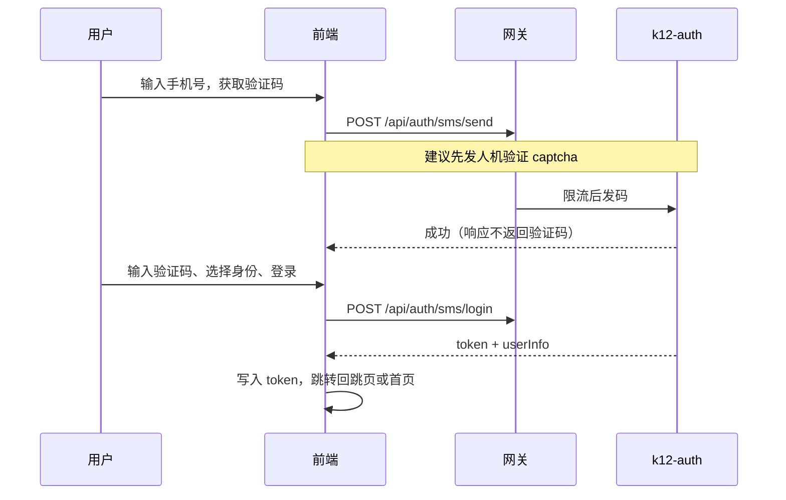

# 新课堂教育 — 登录与注册设计方案

> 本文档描述「新课堂教育」平台的统一认证方案：支持手机号、微信、QQ、企业微信及账号密码登录，兼顾安全与可扩展性。  
> 与现有实现对齐：`k12-auth`（8081）、`k12-gateway`（9000）、前端 `src/views/user/Login.vue`。

---

## 目录

1. [现状与目标](#现状与目标)
2. [前端设计](#前端设计)
3. [后端设计](#后端设计)
4. [安全设计](#安全设计)
5. [与现有代码的差距](#与现有代码的差距)
6. [实施阶段](#实施阶段)
7. [验收标准](#验收标准)
8. [相关文档与文件](#相关文档与文件)

---

## 现状与目标

### 已有能力（可复用）

| 能力 | 前端 | 后端 |
|------|------|------|
| 用户名 + 密码 | `Login.vue` Tab「密码登录」 | `POST /api/auth/login` |
| 手机验证码 | Tab「验证码登录」 | `POST /api/auth/sms/send`、`/sms/login` |
| 注册 | Tab「注册」 | `POST /api/auth/register` |
| 微信 / QQ | 底部社交按钮 | `GET /api/auth/oauth/url`、`POST /api/auth/oauth/login` |
| JWT | `localStorage.token` + 请求拦截器 | `JwtUtils`；网关 `AuthGlobalFilter` 透传 `X-User-Id` |

用户实体（`k12-common` → `User.java`）已包含 `oauthType`、`oauthId`（当前为**单第三方绑定**字段）。

OAuth 实现见 `k12-auth/.../OAuthServiceImpl.java`，配置项 `oauth.mock.enabled` 默认为 **true**（开发模拟）。

### 目标

- **登录方式**：微信、QQ、手机号、企业微信；账号密码作为补充方式。
- **注册**：以手机号为主；第三方首次登录自动建号，可选补全资料。
- **安全可靠**：防刷、防重放、密钥不落库、绑定关系可审计、可注销失效。

---

## 前端设计

### 页面结构

```
/login                    统一登录页（主入口）
/login/oauth/callback     OAuth 回调（微信 / QQ / 企业微信）
/register                 可选独立注册页（或合并到登录 Tab）
/bind-phone               第三方登录后强制 / 可选绑定手机
/account/security         个人中心：绑定 / 解绑第三方、改密、注销
```

### 信息架构（推荐布局）

```
┌─────────────────────────────────────────┐
│  📚 新课堂教育                           │
│  优质 K12 教学资源，一站备课              │
├─────────────────────────────────────────┤
│  [ 手机号登录 ]  ← 默认 Tab               │
│    手机号 + 验证码 + [获取验证码]          │
│    身份：教师 / 学生 / 家长（单选）        │
│    [ 登录 / 注册并登录 ]                  │
├─────────────────────────────────────────┤
│  ─── 其他方式 ───                        │
│  [ 微信 ] [ QQ ] [ 企业微信 ]             │
│  [ 账号密码登录 ]  ← 文字链，展开折叠表单   │
├─────────────────────────────────────────┤
│  登录即表示同意《用户协议》《隐私政策》     │
└─────────────────────────────────────────┘
```

**设计要点**

- **手机号优先**：K12 教师场景下，实名与找回账号均依赖手机。
- **第三方图标一行**：微信（绿）、QQ（蓝）、企业微信（蓝）；hover 提示「使用 xx 登录」。
- **密码登录降级**：减少攻击面，保留给老用户与管理员。
- **注册与登录合一**：验证码通过即「注册 + 登录」（与后端 `smsLogin` 自动建号一致）。

### 交互流程

#### A. 手机号登录 / 注册



#### B. 微信 / QQ（网页授权）

1. `GET /api/auth/oauth/url?type=wechat|qq&redirectUri=...&state=随机串`
2. 前端将 `state` 存入 `sessionStorage`
3. 跳转第三方授权页
4. 回调 `/login/oauth/callback?code=...&state=...`
5. 校验 `state` 后 `POST /api/auth/oauth/login { code, type, state }`
6. 若响应 `needBindPhone: true` → 跳转绑定手机页

**微信说明**：PC 网站使用 [微信开放平台](https://open.weixin.qq.com/) 网站应用；公众号 / 小程序需单独 appId。

#### C. 企业微信（待实现）

企业微信与微信开放平台**不是同一套**，需使用 [企业微信开发者文档](https://developer.work.weixin.qq.com/)：

| 场景 | 推荐方式 |
|------|----------|
| 学校 / 机构统一登录 | 企业微信扫码登录（OAuth2）或网页授权 |
| 仅内部员工 | 自建应用 `snsapi_base` / `snsapi_privateinfo` |

前端增加 `type=wework` 按钮，流程与微信类似；回调后换取企微 `userid`（非微信 openid）。

**首次企微登录**：建议要求绑定手机，或管理员预导入白名单，避免匿名 userid 泛滥。

### 前端安全（浏览器侧）

| 项 | 做法 |
|----|------|
| Token 存储 | 优先 `httpOnly` Cookie（需后端配合）；短期可继续 `localStorage` + 较短过期时间 |
| 记住我 | 不存密码；仅延长 refresh token 有效期 |
| OAuth state | 随机 32 字节存 `sessionStorage`，回调必须校验 |
| HTTPS | 生产全站 HTTPS；OAuth `redirectUri` 配置白名单 |
| 退出 | 清除本地 token + 调用 `POST /api/auth/logout`（服务端 jti 黑名单） |
| 敏感操作 | 改密、解绑第三方需二次验证（短信或密码） |

### 建议 API 封装（扩展 `src/api/auth.ts`）

```typescript
// 类型
type OAuthType = 'wechat' | 'qq' | 'wework'

// 方法
getOAuthUrl(type: OAuthType, redirectUri: string, state: string)
oauthLogin({ code, type, state })
sendSmsCode({ phone, type, captchaToken })
smsLogin({ phone, code, role })
bindPhone({ phone, code })
bindOAuth({ type, code })
unbindOAuth(type)
logout()
refreshToken()
```

---

## 后端设计

### 服务架构

```
浏览器
  → k12-gateway:9000  (/api/auth/**)
       ↓ JWT 校验（白名单放行 login / register / sms / oauth）
  → k12-auth:8081
       ├── AuthService        登录注册编排
       ├── SmsService         短信验证码
       ├── OAuthService       wechat / qq / wework
       ├── CaptchaService     人机验证（建议新增）
       ├── TokenService       JWT + Redis 黑名单（建议新增）
       └── UserBindService    多第三方绑定（建议新增表）
```

网关白名单（`AuthGlobalFilter`）已包含：`/api/auth/login`、`/register`、`/sms/**`、`/oauth/**` 等。

### 数据模型（建议演进）

**当前**：`user` 表字段 `oauth_type` + `oauth_id` → 一个用户仅能绑一种第三方。

**建议新增** `user_oauth_bind`：

| 字段 | 说明 |
|------|------|
| id | 主键 |
| user_id | 平台用户 ID |
| provider | wechat / qq / wework |
| open_id | 平台 openid 或企微 userid |
| union_id | 微信 unionid（可选，多端统一） |
| corp_id | 企微 corpId（企微场景必填） |
| nickname, avatar | 快照 |
| bind_time | 绑定时间 |
| **唯一约束** | `(provider, open_id, corp_id)` |

`user` 表保留：`phone`（建议唯一索引）、`password`（BCrypt）、`role`、`status`。

**登录审计** `auth_login_log`（可选）：

`user_id, provider, ip, user_agent, success, fail_reason, created_at`

### 接口设计

| 方法 | 路径 | 说明 |
|------|------|------|
| POST | `/api/auth/captcha` | 获取图形 / 滑块 challenge（发码前） |
| POST | `/api/auth/sms/send` | 发送验证码（限流 + captcha） |
| POST | `/api/auth/sms/login` | 验证码登录 / 自动注册 |
| POST | `/api/auth/login` | 账号密码登录 |
| POST | `/api/auth/register` | 用户名 / 邮箱注册（可选） |
| GET | `/api/auth/oauth/url` | `type=wechat\|qq\|wework`，返回授权 URL |
| POST | `/api/auth/oauth/login` | 用 code 换 token |
| POST | `/api/auth/bind/phone` | 已登录用户绑定手机 |
| POST | `/api/auth/bind/oauth` | 已登录用户绑定第三方 |
| DELETE | `/api/auth/bind/oauth/{provider}` | 解绑（须保留至少一种登录方式） |
| POST | `/api/auth/logout` | 注销（jti 入黑名单） |
| POST | `/api/auth/token/refresh` | 刷新令牌 |
| GET | `/api/auth/current` | 当前用户（需 JWT） |

**统一登录成功响应（建议）**

```json
{
  "code": 200,
  "message": "登录成功",
  "data": {
    "accessToken": "eyJ...",
    "expiresIn": 86400,
    "refreshToken": "可选",
    "userInfo": {
      "id": 1,
      "nickname": "张老师",
      "role": "teacher",
      "phone": "138****0000",
      "avatar": "https://...",
      "bindStatus": ["wechat"]
    },
    "needBindPhone": false,
    "isNewUser": false
  }
}
```

### 核心业务逻辑

#### 手机号

1. 校验 captcha（防脚本刷码）
2. 发码：同手机 60 秒间隔、同 IP 日限额、同手机每日上限（现有 `SmsServiceImpl` 已实现部分逻辑）
3. 验码：一次性、5 分钟过期
4. 无用户则自动注册；有用户则校验 `status`、`role`
5. **生产环境**接入真实短信（阿里云 / 腾讯云）；开发可控制台打印

#### 微信 / QQ

1. `state` 服务端 Redis 存 nonce（5 分钟），回调校验防 CSRF
2. `code` 换 `access_token` + `openid`
3. 查 `user_oauth_bind` → 已绑定则登录；未绑定则建用户 + 写绑定
4. 微信建议存 **unionid**，便于多端账号合并

#### 企业微信

1. 配置：`corp-id`、`agent-id`、`secret`、`redirect-uri`
2. 扫码 / OAuth 获取 `userid`
3. 可选调用「读取成员」API 同步姓名、部门
4. **B 端**：仅允许白名单 `corp_id`（签约学校）

#### 密码

- 仅使用 **BCrypt**（生产应移除明文密码兼容逻辑）
- 登录失败 5 次锁定 15 分钟（Redis）
- 注册密码强度：建议 ≥8 位，含字母与数字

### 配置示例（`k12-auth/application.yml`）

```yaml
oauth:
  mock:
    enabled: false   # 生产必须为 false
  weixin:
    app-id: ${WECHAT_APP_ID}
    app-secret: ${WECHAT_APP_SECRET}
    redirect-uri: https://your-domain.com/login/oauth/callback
  qq:
    app-id: ${QQ_APP_ID}
    app-secret: ${QQ_APP_SECRET}
    redirect-uri: https://your-domain.com/login/oauth/callback
  wework:
    corp-id: ${WEWORK_CORP_ID}
    agent-id: ${WEWORK_AGENT_ID}
    secret: ${WEWORK_SECRET}
    redirect-uri: https://your-domain.com/login/oauth/callback

jwt:
  secret: ${JWT_SECRET}   # 与 gateway、resource 一致
  expiration: 86400000

app:
  frontend-base-url: https://your-domain.com
```

---

## 安全设计

| 威胁 | 措施 |
|------|------|
| 短信轰炸 | 图形验证码 + IP / 手机号限流 + 运营商模板限频 |
| 验证码爆破 | 6 位码 + 错误次数锁定 + 单次有效 |
| OAuth 伪造 | state 防 CSRF；code 仅用一次；redirectUri 白名单 |
| Token 泄露 | 短 access（如 2h）+ refresh；HTTPS 全站 |
| 注销后 Token 仍有效 | Redis 存 `jti` 黑名单至过期 |
| 密钥泄露 | `app-secret` 仅环境变量 / 密钥管理服务，不进 Git |
| 越权访问 | 网关统一鉴权；管理接口需 `admin` 角色 |
| 账号劫持绑定 | 绑手机 / 绑第三方需已登录 + 短信二次确认 |
| 企微冒充 | 校验 `corp_id`；可选同步通讯录比对 |

**JWT 载荷建议**：`sub=userId, username, role, jti, iat, exp`

**合规**：登录页展示《用户协议》《隐私政策》；说明手机号用途；K12 场景下学生账号建议由教师 / 学校导入，而非开放自助注册。

---

## 与现有代码的差距

| 项 | 现状 | 建议 |
|----|------|------|
| 企业微信 | 未实现 | 新增 `WeworkOAuthProvider` + 前端按钮 |
| 多第三方绑定 | `user.oauth_type` 单字段 | 迁移至 `user_oauth_bind` |
| OAuth state | 前端未强制校验 | 服务端 Redis 存 state |
| 密码校验 | 存在明文兜底 | 仅 BCrypt |
| 发码 | 无人机验证 | captcha 前置 |
| 登出 | 仅前端清 token | 后端 jti 黑名单 |
| OAuth | 默认 mock | 生产关闭 mock |
| 注册 | 偏邮箱用户名 | 手机号为主路径 |

---

## 实施阶段

| 阶段 | 内容 | 参考周期 |
|------|------|----------|
| **M1** | 手机号加固：captcha、登录限流、登出黑名单、移除明文密码 | 1–2 周 |
| **M2** | 微信 / QQ 生产 OAuth、state、`user_oauth_bind` 表 | 1–2 周 |
| **M3** | 企业微信扫码、corp 白名单、绑定手机流程 | 2 周 |
| **M4** | 个人中心绑定管理、登录日志、风控监控 | 1 周 |

---

## 验收标准

- [ ] 未登录无法访问需鉴权 API；Token 过期返回 401 并跳转登录
- [ ] 短信接口无人机验证无法发码；超限返回 429
- [ ] OAuth 回调 `state` 错误时拒绝登录
- [ ] 生产环境关闭 OAuth mock；密钥不在代码仓库
- [ ] 同一微信 / QQ / 企微账号重复绑定有明确提示
- [ ] `status=0` 的禁用用户无法登录
- [ ] 企微登录仅允许签约 `corp_id`（若启用 B 端策略）
- [ ] 网关与资源服务 JWT 密钥一致，`X-User-Id` / Bearer 均可解析用户

---

## 相关文档与文件

### 文档

| 文件 | 说明 |
|------|------|
| [database-design.md](./database-design.md) | 数据库整体设计 |
| [实施说明-P0-P1-P2.md](./实施说明-P0-P1-P2.md) | 资源模块 P0–P2 实施说明 |

### 前端（本仓库）

| 文件 | 说明 |
|------|------|
| `src/views/user/Login.vue` | 登录 / 注册 / 第三方入口 |
| `src/api/auth.ts` | 认证 API |
| `src/store`（userStore） | 登录态 |
| `src/api/request.ts` | JWT 拦截器 |

### 后端（`../k12-edu-microservice`）

| 文件 | 说明 |
|------|------|
| `k12-auth/.../AuthController.java` | 认证接口 |
| `k12-auth/.../AuthServiceImpl.java` | 登录注册逻辑 |
| `k12-auth/.../OAuthServiceImpl.java` | 微信 / QQ OAuth |
| `k12-auth/.../SmsServiceImpl.java` | 短信验证码 |
| `k12-gateway/.../AuthGlobalFilter.java` | 网关 JWT + 白名单 |
| `k12-common/.../entity/User.java` | 用户实体 |
| `k12-common/.../util/JwtUtils.java` | JWT 工具 |

---

*文档版本：v1.0 · 与当前代码库对照编写，实施时以实际代码与接口为准。*
