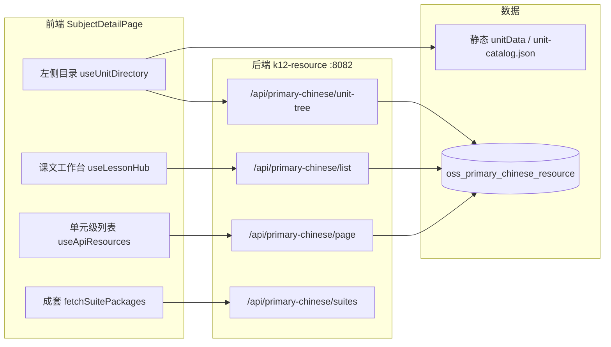

# K12 资源平台架构与多学科品牌设计方案

> 本文档汇总学科详情页、首页专区、真实数据上传、七彩课堂、状元版目录，以及学科网式前端等讨论结论。  
> 适用项目：`k12-edu-platform`（前端）、`k12-edu-microservice`（后端）、库 `xinketang`。  
> 文档日期：2026-05-20  
> **方案 A 分阶段落地（实施主文档）**：[方案A-学科网式落地实施计划.md](./方案A-学科网式落地实施计划.md)

---

## 目录

1. [背景与问题](#1-背景与问题)
2. [首页专区数据问题与 SQL 补丁](#2-首页专区数据问题与-sql-补丁)
3. [学科详情页：数据流与测试](#3-学科详情页数据流与测试)
4. [真实数据上传：OSS、数据库与预览](#4-真实数据上传oss数据库与预览)
5. [七彩课堂：目录映射与前端适配](#5-七彩课堂目录映射与前端适配)
6. [状元版：目录结构与映射](#6-状元版目录结构与映射)
7. [统一架构：品牌 + 分类树 + 资源挂载](#7-统一架构品牌--分类树--资源挂载)
8. [参照学科网的前端设计结论](#8-参照学科网的前端设计结论)
9. [实施路线图](#9-实施路线图)
10. [关键文件索引](#10-关键文件索引)

---

## 1. 背景与问题

### 1.1 学科详情页（用户关注页面）

路由：`/subject/:stage/:subject/:version`（`SubjectDetailPage.vue`）

典型筛选示例：

```text
小学 ／ 语文 ／ 一年级上册 ／ 统编版(2024) ／ 同步备课 ／ 我上学了 ／ 我是中国人
```

列表主数据表：`xinketang.oss_primary_chinese_resource`（宽表，实体 `PrimaryChineseResource`）。

### 1.2 首页三大专区

| 专区 | 组件 | API |
|------|------|-----|
| 同步备课 | `SyncResourceModule.vue` | `GET /api/home/panels/sync-prep` |
| 试卷专区 | `PaperModule.vue` | `GET /api/home/panels/paper-zone` |
| 升学专区 | `ExamModule.vue` | `GET /api/home/panels/promotion` |

配置驱动：`home_panel_tab_config`（脚本 `23_home_panel_tab_config.sql`）。

### 1.3 核心矛盾

- **宽表** `module` + `type` + `unit_name` + `lesson_name` 适合教习网式「单元/课」，难以表达 **状元版 3～4 层产品分类树**。
- **品牌**（七彩课堂、状元版）在库中 **无独立字段**，无法筛选。
- 演示数据与前端 **默认筛选** 不一致时，API 返回 `[]`，页面空白（`apiLoaded` 后不再显示占位数据）。

---

## 2. 首页专区数据问题与 SQL 补丁

### 2.1 错误：`unit_name` 无默认值

执行 `24_home_panel_p1.sql` 时若报错：

```text
[HY000][1364] Field 'unit_name' doesn't have a default value
```

原因：表 `oss_primary_chinese_resource` 中 `unit_name` 为 `NOT NULL`，INSERT 未包含该列。

修复：INSERT 增加 `unit_name`，试卷类演示数据可填 `'综合'`。

### 2.2 列表为空：种子与默认筛选不匹配

| 专区 | 默认筛选 | 问题 |
|------|----------|------|
| 试卷专区 | 小学 + **六年级下册** + **期中** | 种子仅有四年级下册期中，无六年级 |
| 同步备课 | 高中 + 历史 + 课件 | OSS 演示多为小学语文，仅 1 条 edu |
| 升学专区 | 部分专题 | module/标题与 `home_panel_tab_config` 不一致 |

### 2.3 已提供的 SQL 脚本

| 脚本 | 说明 |
|------|------|
| `sql/23_home_panel_tab_config.sql` | Tab 查询配置 |
| `sql/24_home_panel_p1.sql` | 演示资源 + 升学 Tab 分学段 |
| `sql/25_home_panel_featured.sql` | 运营置顶 |
| `sql/26_home_panel_demo_patch.sql` | **增量补丁**（已跑过 24/25 时单独执行） |

`26` 主要内容：

- `10108`–`10109`：小学六年级下册期中
- `10130`–`10134`：高中历史同步备课
- `10209`–`10212`：升学专题补充
- 修正 `10200`/`10201` 真题标题
- 置顶 id 5、6

执行后刷新首页（`Ctrl+F5`）。

---

## 3. 学科详情页：数据流与测试

### 3.1 架构数据流



### 3.2 用户操作与 API 对应

| 操作 | 前端 | API | 查询要点 |
|------|------|-----|----------|
| 打开页 / 换册别 | `unit-tree` | `GET /api/primary-chinese/unit-tree` | 静态 JSON + DB 合并 |
| 点 **父单元**「我上学了」 | `useApiResources` | `GET /api/primary-chinese/page` | `unitName=我上学了`，无 `lessonName` |
| 点 **叶子课文**「我是中国人」 | `useLessonHub` | `GET /api/primary-chinese/list` | `unitName` + `lessonName` |
| 找成套 | `getSuites` | `GET /api/primary-chinese/suites` | 按 type 聚合 |
| 上传 | `goToUpload` | 见第 4 节 | `buildUploadLocation` 带上下文 |

课文模式判断（`useLessonHub`）：`activeUnit` 为叶子且 `resolveParentUnitName(unit) !== unit` 时启用 `list`，并 **关闭** `page` 请求（`useLessonHubGate`）。

### 3.3 环境启动

| 服务 | 端口 | 必须 |
|------|------|------|
| MySQL `xinketang` | 3306 | ✅ |
| k12-resource | 8082 | ✅ |
| 前端 Vite | 5173 | ✅ |
| k12-gateway | 9000 | 可选（Vite 已代理 `/api` → 8082） |

### 3.4 健康检查 URL

```http
GET http://localhost:8082/api/primary-chinese/page?stage=小学&subject=语文&gradeName=一年级上册&edition=统编版(2024)&module=同步备课&current=1&size=10

GET http://localhost:8082/api/primary-chinese/list?stage=小学&subject=语文&gradeName=一年级上册&edition=统编版(2024)&module=同步备课&unitName=我上学了&lessonName=我是中国人

GET http://localhost:8082/api/primary-chinese/unit-tree?gradeName=一年级上册&edition=统编版(2024)&subject=语文&volumeKey=y1s1
```

`list` 返回 `[]` 表示 **接口正常但无数据**，需导入或上传，非接口故障。

### 3.5 测试清单（P0）

- [ ] 三个 API 均 200
- [ ] 点课文后 Network 为 `list`（非仅 `page`）
- [ ] 面包屑与筛选一致
- [ ] 上传 1 条后列表可见（`status=1`，`is_deleted=0`）
- [ ] 详情与预览（本地上传 URL 最稳）

### 3.6 完整性评估（针对本页）

| 能力 | 状态 |
|------|------|
| 学段/学科/册别/版本 | ✅ |
| 栏目 module + 类型 type | ✅ |
| 单元/课文树 | ⚠️ 静态为主，需补全 y1s1 |
| 品牌/系列 | ❌ 无字段 |
| 批量入库 | ⚠️ 仅后端 `batch-save` |
| 专题/考试布局 demo 数据 | ⚠️ API 空时显示假数据 |

---

## 4. 真实数据上传：OSS、数据库与预览

### 4.1 存储两层结构

| 层级 | 说明 |
|------|------|
| **文件本体** | 本地 `~/k12-uploads`（`POST /api/file/upload`）或 MinIO / 阿里云 OSS |
| **元数据** | `oss_primary_chinese_resource`（列表/筛选）；规范表 `edu_resource` + 维度（长期） |

**仅有 OSS 文件不会出现在列表**，必须写入数据库且 `status=1`、`is_deleted=0`。

### 4.2 宽表关键字段

| 字段 | 页面筛选 |
|------|----------|
| `stage` | 小学 |
| `subject` | 语文 |
| `grade_name` | 一年级上册 |
| `edition` | 统编版(2024)（须与前端字符串完全一致） |
| `module` | 同步备课 / 期中 / … |
| `type` | 课件 / 教案 / … |
| `unit_name` | 我上学了（**NOT NULL**） |
| `lesson_name` | 我是中国人（叶子课） |
| `oss_url` / `oss_bucket` / `oss_object_key` | 文件访问 |
| `status` | `1` 已发布 |

### 4.3 方式 A：页面上传（推荐验证）

1. 路由 `/upload`，从学科页跳转自动带筛选。
2. `fileApi.upload()` → 本地或配置的 `upload.base-url`。
3. `primaryChineseApi.save()` / `saveDraft` + `submitDraft` 写宽表。

`buildSyncPayload` 字段与列表查询一致（`useResourceUploadForm.ts`）。

### 4.4 方式 B：OSS + 批量写库

1. `ossutil` 等上传到 bucket，路径建议：

```text
{brand}/{edition}/{volume}/{subject}/{module}/{unit}/{lesson}/{type}/{filename}
```

2. 调用 `POST /api/primary-chinese/batch-save`（前端 API 未封装，可直接 HTTP）。

### 4.5 预览失败原因

`DocumentPreviewServiceImpl` **优先读本地** `upload.path` 下文件。若 `oss_url` 为外网私有链或 `example.com` 演示地址，会退回 embed 模式，常无法预览。

处理：

- 开发：使用 `http://localhost:8082/uploads/...`
- 生产：OSS 公共读或签名 URL；或安装 **LibreOffice**（`app.preview.libreoffice-enabled`）

配置见 `k12-resource/src/main/resources/application.yml`。

---

## 5. 七彩课堂：目录映射与前端适配

### 5.1 思维导图 vs 现有模型

| 维度 | 七彩课堂 | 现有系统 |
|------|----------|----------|
| 教材版本 | 统编版(2024) | `edition` ✅ |
| 品牌 | 七彩课堂 | **无字段** ❌ |
| 主轴 | 单元 → 课文 → 板块 | `unit_name` + `lesson_name` |
| 课内细分 | 辅教、视频、课件版本 | 仅 `type` |
| 期中/期末/教师包 | 独立板块 | 部分可映射 `module` |

### 5.2 栏目（module）映射建议

| 思维导图分支 | `module` | `type` |
|-------------|----------|--------|
| 单元·课·课件教案 | 同步备课 | 课件/教案/视频/练习… |
| 单元导语 / 口语交际 / 习作 / 语文园地 | 同步备课 | 课件/教案/练习；`lesson_name` 或独立 unit |
| 单元复习 | 同步备课 | 知识点/学案 |
| 期中/期末复习卷 | 期中/期末 | 试卷 |
| 国学阅读 | 阅读 | 学案 |
| 教师工作包 | 纯素材（或新栏目） | 教案/课件 |

### 5.3 前端适配要点（概要）

1. **新增** `resourceSeriesConfig.ts`、`useResourceSeries`（系列：七彩课堂 / 全部）。
2. **URL / 浏览上下文** 增加 `brand`、`pack`（`useResourceBrowseContext`、`uploadRoute`）。
3. **FilterBar** 增加「资源系列」行；`CourseCatalog` 出版社随系列变化。
4. **API 参数** `primaryChineseApi` 增加 `brand`、`packCode`、`subType`。
5. **LessonGroupedList** 二级分组：`type` → `subType`（精品版/必备版课件）。
6. **目录** 扩展 `unitData.ts` / `catalog/unit-catalog.json` 的 `y1s1` 或 `qicai-y1s1`。
7. **上传页** 锁定品牌、课件版本、packCode。

### 5.4 入库 JSON 示例

```json
{
  "stage": "小学",
  "subject": "语文",
  "edition": "统编版(2024)",
  "gradeName": "一年级上册",
  "module": "同步备课",
  "type": "课件",
  "unitName": "第一单元·识字",
  "lessonName": "1 天地人",
  "title": "【七彩课堂】1 天地人 精品版课件",
  "remark": "{\"brand\":\"七彩课堂\",\"coursewareVariant\":\"精品版\"}",
  "ossUrl": "https://...",
  "status": 1
}
```

---

## 6. 状元版：目录结构与映射

### 6.1 第一层：核心资源总分类

- 一、上课课件
- 二、其他资源
- 三、教案
- 四、作业课件

### 6.2 第二层概要

**一、上课课件**（PPT、希沃版 PPT、MP3、MP4、WMV）

- 教案版、双减作业设计精华版、交互吧、课文朗读和听写视频、交互笔顺

**二、其他资源**

- 备课资源（8 子项：日月积累、专项学习、教学反思、期末总复习、生字卡片、相关音频、说课稿、课堂实录）
- 安装软件
- 计划加总结（工作总结、工作计划、班主任计划加总结）

**三、教案**

- 各单元完整教案

**四、作业课件**

- 各单元作业课件 PPT + 对应答案

### 6.3 与平台栏目（module）映射

| 状元第一层 | 建议 `module` | 建议 `type` / 说明 |
|------------|---------------|-------------------|
| 上课课件 | 同步备课 | 课件；`sub_type`：教案版、双减精华… |
| 其他资源 | 纯素材 / 备课资源 | 教案、视频、音频… |
| 教案 | 同步备课 | 教案 |
| 作业课件 | 同步备课 | 课件 + `file_role=answer` 存答案 |

### 6.4 与七彩的差异

| 维度 | 七彩课堂 | 状元版 |
|------|----------|--------|
| 第一主轴 | 教材单元/课 | **产品分类树** |
| 树深度 | 单元-课-板块 | 3～4 层文件夹 |
| UI 主模式 | 课文工作台 | **分类列表** / **单元矩阵**（各单元教案） |

**不能** 强迫状元版全部塞进「单元/课」一棵树，应 **品牌切换 → 换 catalog scheme**。

---

## 7. 统一架构：品牌 + 分类树 + 资源挂载

### 7.1 四层模型（推荐）

```text
L0 平台维度     学段 / 学科 / 年级册别 / 教材版本 (edition)
L1 资源品牌     七彩课堂 | 状元版 | 平台 UGC
L2 目录方案     textbook_unit | zy_taxonomy
L3 分类树节点   catalog_node（无限层级）
L4 资源与文件   edu_resource + edu_resource_file
```

平台顶栏 **栏目**（同步备课、期中）与 **品牌目录** 解耦：栏目是导航场景，节点是资源归属。

### 7.2 建议新增表

| 表 | 用途 |
|----|------|
| `edu_resource_brand` | 品牌 code/name |
| `edu_catalog_scheme` | 目录方案（绑定品牌） |
| `edu_catalog_node` | 统一树节点（七彩单元课 + 状元四层分类） |
| `edu_resource_placement` | 资源挂载节点（可多个） |
| `edu_resource_pack` | 可选，整册资源包 |

保留：

- `edu_module`、`edu_resource_type`（平台枚举）
- `edu_unit` / `edu_lesson`（可与 catalog 同步）
- `oss_primary_chinese_resource` 作为 **浏览读模型 / 同步宽表**

### 7.3 OSS 路径规范

```text
{bucket}/{brand_code}/{edition_code}/{volume_code}/{subject_code}/{catalog_path}/{resource_id}/main.pptx
```

`catalog_path` 与 `edu_catalog_node.name_path` 一致。

### 7.4 后端服务划分

```text
CatalogService          -- 按 scheme 返回树
ResourceBrowseService   -- 列表/分页/统计
ResourceImportService   -- 目录批量导入
ResourceSyncService     -- edu_resource → 宽表
```

### 7.5 新 API（学科页契约）

| API | 说明 |
|-----|------|
| `GET /api/catalog/tree?schemeId=&volumeId=` | 左侧树 |
| `GET /api/resources/browse` | 统一列表 |
| `GET /api/resources/browse/stats` | 类型数量角标 |
| `POST /api/resources/import/batch` | 批量导入 |

兼容期：`/api/primary-chinese/*` 内部转调或读宽表视图。

### 7.6 前端：CatalogAdapter 策略

```text
品牌=七彩 → scheme=textbook_unit → 课文工作台 (LessonGroupedList)
品牌=状元 → scheme=zy_taxonomy   → 分类列表 / 单元矩阵
```

统一 `BrowseContext`：stage, subject, edition, volume, **brand**, catalogNodeId, module?, type?

---

## 8. 参照学科网的前端设计结论

### 8.1 结论

**学科详情主流程参照学科网（教习网类）更合理、更方便**；底层仍用「品牌 + 分类树 + 挂载」，不要把 UI 做成与数据模型两套体系。

### 8.2 与现有实现重合度

学科网：**版本册别 → 左树目录 → 类型 Tab → 本课资源**

你们已有：`CourseCatalog`、`useUnitDirectory`、`useLessonHub`、`ResourceTypeBar`、`FilterBar` — 约 70% 已对齐。

### 8.3 学科网壳 + 多品牌内核

| 品牌 | 学科网式用法 |
|------|--------------|
| 七彩课堂 | 标准左树 + 本课分组 |
| 状元版 | 左树换为产品分类；「各单元教案」用 **单元 Tab 矩阵** |
| 增量 | 版本区旁 **资源系列**（七彩/状元） |

### 8.4 不宜照搬的部分

- 左侧永远只有「单元/课」（状元对不上）
- 一条资源一种文件（需多文件：答案、希沃版）
- 无品牌维度（需系列行）

### 8.5 推荐方案对比

| 方案 | 说明 |
|------|------|
| **A. 学科网骨架 + 品牌换树**（推荐） | 一个 SubjectDetailPage，displayMode 切换 |
| B. 七彩/状元两整页 | 维护成本高 |
| C. 完全自定义双轨导航 | 用户学习成本高 |

### 8.6 学科网应对齐的 UI 点

1. 顶部：学科 · 册别 · 版本 · **系列** · 出版社  
2. 左树：单元/课/板块图标区分，选中课 → 本课资源  
3. 类型 Tab + **数量角标**（`browse/stats`）  
4. 面包屑完整路径  
5. 上传带当前章节上下文  
6. 期中/期末栏目切换 → exam/topic 布局（弱化 demo 假数据）

---

## 9. 实施路线图

### 9.1 首页与数据（已完成脚本）

| 阶段 | 内容 |
|------|------|
| Done | `23`–`26` SQL，unit_name 修复，首页演示补丁 |

### 9.2 学科页与上传（短期）

| 阶段 | 数据库 | 后端 | 前端 |
|------|--------|------|------|
| M1 | brand 字段或宽表 `brand_code` | browse 参数 | 系列行 + API 透传 |
| M2 | 状元/七彩 catalog 种子 | catalog/tree | 换树 + 列表 |
| M3 | placement + edu_resource 主写 | 同步宽表 | 收敛 useCatalogBrowse |

### 9.3 产品与学科网对齐（中期）

| 阶段 | 内容 |
|------|------|
| M4 | OSS 批量导入、pack、closure 表 |
| M5 | 类型角标、多文件详情、希沃/答案展示 |
| M6 | 关闭 topic/exam 假数据；module-stats 角标 |

---

## 10. 关键文件索引

### 10.1 前端（k12-edu-platform）

| 路径 | 说明 |
|------|------|
| `src/views/resource/SubjectDetailPage.vue` | 学科详情总控 |
| `src/composables/useLessonHub.ts` | 课文工作台 list |
| `src/composables/useApiResources.ts` | 分页 page |
| `src/composables/useUnitDirectory.ts` | 单元树 |
| `src/composables/useResourceBrowseContext.ts` | URL 同步 |
| `src/composables/useResourceUploadForm.ts` | 上传 |
| `src/config/subjectConfig.ts` | 学段/学科/版本/栏目 |
| `src/config/unitData.ts` | 静态单元（y1s1 等） |
| `src/constants/uploadRecommend.ts` | 栏目 → 类型 |
| `src/api/primaryChinese.ts` | 宽表 API |
| `src/api/file.ts` | 上传与预览 |
| `docs/实施说明-P0-P1-P2.md` | 接口与验收清单 |
| `docs/数据库设计方案.md` | 规范表设计 |

### 10.2 后端（k12-edu-microservice）

| 路径 | 说明 |
|------|------|
| `k12-resource/.../PrimaryChineseResourceController.java` | 宽表 CRUD |
| `k12-resource/.../HomePanelService.java` | 首页专区 |
| `k12-resource/.../UnitCatalogService.java` | 单元树合并 |
| `k12-resource/.../FileServiceImpl.java` | 本地上传 |
| `k12-resource/.../DocumentPreviewServiceImpl.java` | 预览 |
| `k12-common/.../PrimaryChineseResource.java` | 实体 |
| `sql/08_legacy_business.sql` | 宽表 DDL |
| `sql/05_resource.sql` | edu_resource 规范表 |
| `sql/23`–`26` | 首页与补丁 |

### 10.3 配置示例

```yaml
# k12-resource application.yml
upload:
  path: ${user.home}/k12-uploads
  base-url: http://localhost:8082/uploads
app:
  preview:
    enabled: true
    libreoffice-enabled: true
```

```typescript
// vite.config.ts 代理
proxy: {
  '/api': { target: 'http://localhost:8082' },
  '/uploads': { target: 'http://localhost:8082' },
}
```

---

## 修订记录

| 日期 | 说明 |
|------|------|
| 2026-05-20 | 初版：汇总会话讨论（首页 SQL、学科页测试、上传预览、七彩/状元/统一架构、学科网结论） |

---

## 附录：相关讨论议题速查

| 议题 | 见章节 |
|------|--------|
| 首页空白 / 期中无数据 | §2 |
| 如何上传真实课件 | §4 |
| 预览不了 | §4.5 |
| 批量上传 | §4.4、`batch-save` |
| 学科页怎么测 | §3 |
| 七彩课堂怎么存 | §5、§7 |
| 状元版目录怎么存 | §6、§7 |
| 前端要不要改 | §5.3、§8 |
| 是否参照学科网 | §8 |
| SQL 26 增量 | §2.3 |
